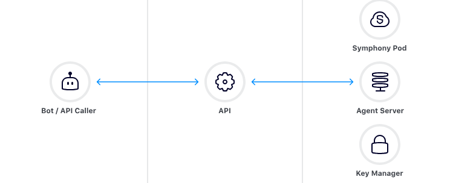
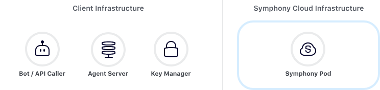

# symphony-agent-service

Symphony is a messaging, voice, directory and analytics software for the financial services industry. The Symphony Developer Center has API documentation & resources for the four interconnected platforms; Messaging, Voice, Directory & Analytics. Automate workflows, integrate apps, and implement APIs.

## Overview of Symphony Messaging REST API Architecture
Symphony Messaging REST API is spread out over three main components: the Pod, API Agent and Key Manager. 

The Symphony Messaging Pod is a dedicated Symphony Messaging instance for each customer environment. It is a cloud-hosted component that handles all core operations necessary to provide the Symphony Messaging service to you. Since Symphony Messaging provides end-to-end encrypted messaging, all messages passed from user to user are fully encrypted at the time of sending, such that no Pod ever has access to the unencrypted contents of any message.

The API Agent is the component responsible for encrypting and decrypting content sent from and to a bot. The Agent provides REST API endpoints that allow a bot to send and receive encrypted messages, acting as the intermediary between a bot and the Symphony Messaging Pod. In order to safely encrypt and decrypt these messages, the Agent server interacts the Key Manager which provides the keys used for encrypting and decrypting messages.

The Key Manager generates and stores encryption keys which are used to encrypt and decrypt messages by the Agent Server. The Key Manager provides an authentication API that provides a unique Key Manager Token to a calling bot. This token is used to encrypt/decrypt messages on the Agent Server.

### Interacting with the Components

Source: https://docs.developers.symphony.com/bots/overview-of-rest-api/rest-api-architecture

For enterprises and security reasons, the API Agent and Key Manager components are deployed on-premise, while the Pod is always deployed in the cloud. Your bot or REST API caller is an application that must be deployed on-premise in this scenario.

An visual representation showing an on-premise deployment of Symphony Messaging components is shown below:

The symphony-agent-service is responsisble for managing end-to-end lifecylce for setting up the agent API server on-premise. Through this service, we can setup the agent server, start/stop/restart the agent server, log rotation, backup etc. Refer https://docs.developers.symphony.com/admin-guide/agent-guide for agent related queries.